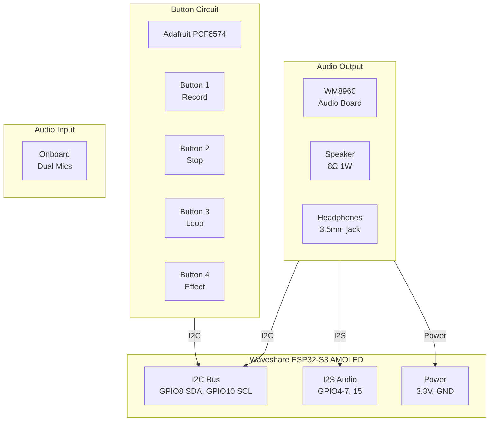
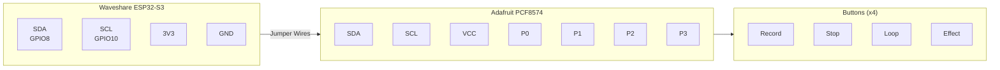
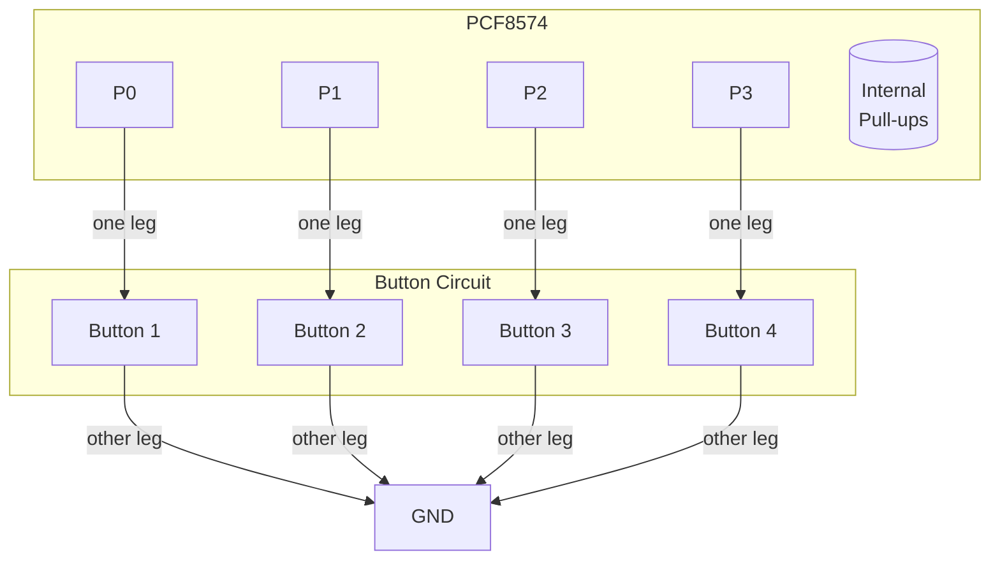
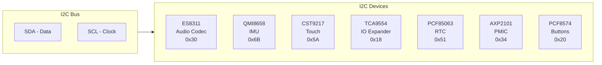
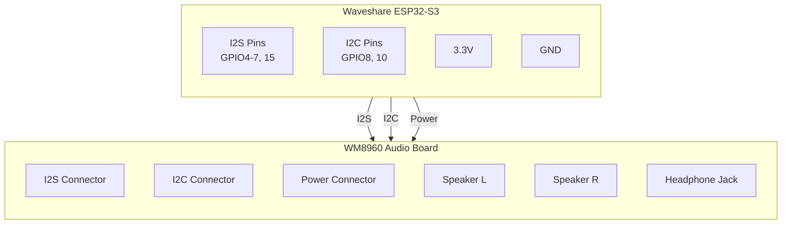
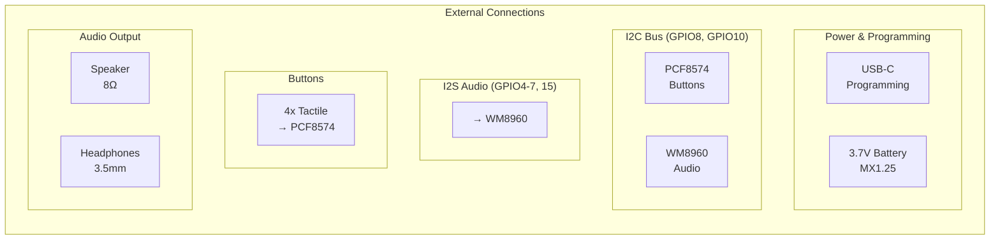

# Tombogo Collab Gadget - Full Wiring Diagram

## System Overview

---

## Button Wiring

### Button Connections

| PCF8574 Pin | Function | Wire Color (suggested) |
|-------------|----------|----------------------|
| P0 | Record Button | Red |
| P1 | Stop Button | Orange |
| P2 | Loop Select | Yellow |
| P3 | Effect Bypass | Green |
| VCC | 3.3V | White |
| GND | Ground | Black |

### Button Circuit (Internal)

---

## I2C Connections

### Complete I2C Wiring

| ESP32 Pin | Signal | Device | Address |
|-----------|--------|--------|---------|
| GPIO8 | SDA | ES8311 | 0x30 |
| GPIO8 | SDA | QMI8658 | 0x6B |
| GPIO8 | SDA | CST9217 | 0x5A |
| GPIO8 | SDA | TCA9554 | 0x18 |
| GPIO8 | SDA | PCF85063 | 0x51 |
| GPIO8 | SDA | AXP2101 | 0x34 |
| GPIO8 | SDA | **PCF8574** | **0x20** |
| GPIO10 | SCL | *(all above)* | - |

**Note:** All devices share the same SDA/SCL lines - this is how I2C works!

---

## Audio Board Wiring (WM8960)

### WM8960 Connections

#### I2S Audio (Digital Audio)

| ESP32 Signal | ESP32 GPIO | WM8960 Pin | Notes |
|--------------|------------|------------|-------|
| BCLK | GPIO4 | BCLK | Bit clock |
| WCLK (LRCK) | GPIO15 | WS | Word select |
| DOUT | GPIO5 | DIN | Data to codec |
| DIN | GPIO6 | DOUT | Data from codec |
| MCLK | GPIO7 | MCLK | Master clock |

#### I2C Control

| ESP32 Signal | ESP32 GPIO | WM8960 Pin |
|--------------|------------|------------|
| SDA | GPIO8 | SDA |
| SCL | GPIO10 | SCL |

**WM8960 I2C Address:** 0x1A (different from ES8311 at 0x30!)

#### Power

| ESP32 | WM8960 Board |
|-------|--------------|
| 3V3 | VCC |
| GND | GND |

#### Speaker Output

| WM8960 Board | Speaker |
|---------------|---------|
| SPK_L | Speaker + |
| SPK_R | Speaker - |

**Recommended:** 8Ω 1W speaker

---

## Complete External Wiring Summary

---

## Pin Reference Table

### ESP32 GPIO Summary

| GPIO | Function | Used By |
|------|----------|---------|
| GPIO0 | PWR Button | Onboard |
| GPIO4 | I2S BCLK | ES8311 / WM8960 |
| GPIO5 | I2S DOUT | ES8311 / WM8960 |
| GPIO6 | I2S DIN | ES8311 / WM8960 |
| GPIO7 | I2S MCLK | ES8311 / WM8960 |
| GPIO8 | I2C SDA | **All I2C devices** |
| GPIO10 | I2C SCL | **All I2C devices** |
| GPIO15 | I2S WCLK | ES8311 / WM8960 |
| GPIO21 | LCD Reset | Display |
| GPIO41 | PA Enable | Amplifier |

### J3 Header (8-pin)

| Pin | Signal | GPIO | Use |
|-----|--------|------|-----|
| 1 | IO1 | GPIO4 | I2S (shared) |
| 2 | IO2 | GPIO5 | I2S (shared) |
| 3 | IO3 | GPIO6 | I2S (shared) |
| 4 | GND | - | Ground |
| 5 | TX | GPIO7 | UART/I2S MCLK |
| 6 | RX | GPIO8 | UART/I2C SDA |
| 7 | 3V3 | - | 3.3V power |
| 8 | GND | - | Ground |

---

## Quick Connect Checklist

- [ ] **I2C:** GPIO8 → PCF8574 SDA, GPIO10 → PCF8574 SCL, 3V3 → VCC, GND → GND
- [ ] **I2S:** GPIO4 → WM8960 BCLK, GPIO5 → WM8960 DIN, GPIO6 → WM8960 DOUT, GPIO7 → WM8960 MCLK, GPIO15 → WM8960 WS
- [ ] **I2C (WM8960):** GPIO8 → WM8960 SDA, GPIO10 → WM8960 SCL
- [ ] **Power (WM8960):** 3V3 → VCC, GND → GND
- [ ] **Buttons:** PCF8574 P0-P3 → 4 buttons → GND
- [ ] **Speaker:** WM8960 SPK_L/R → 8Ω speaker
